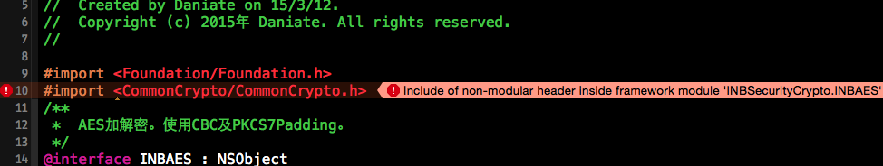
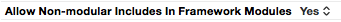

# INBSecurityCrypto

## 密码学相关内容

可通过Target `INBSecurityCryptoAggregate`构建framework

可通过Target `INBSecurityCrypto`，进行测试，详细内容请参考测试代码及相关注释

当使用`INBSecurityCrypto.framework`时，如果出现错误：`Include of non-modular header inside framework module ***`

需要对项目配置进行修改：

TARGETS -> Build Settings -> Language - Modules，将`Allow Non-modular includes In Framework Modules`设置为`YES`

---

### 包含的加密算法

> 不包含流加密算法RC4

#### 公钥加密算法

* RSA（加解密、创建及验证数字签名时，都使用PKCS1 Padding填充模式。数字签名只支持SHA哈希函数。）

#### 分组对称加密算法

只支持PKCS7 Padding、No Padding填充模式。

只支持ECB、CBC模式。

* AES（AES-128、AES-192、AES-256）
* DES
* TripleDES（3DES）
* CAST
* RC2
* Blowfish

---

### 包含的哈希算法

#### 消息摘要算法

* MD 2
* MD 4
* MD 5

#### 安全哈希算法

* SHA1
* SHA224
* SHA256
* SHA384
* SHA512

---

### 包含的HMAC

* Hmac SHA1
* Hmac MD5
* Hmac SHA256
* Hmac SHA384
* Hmac SHA512
* Hmac SHA224

---

### 包含的编码方式

* Base-64
* Hex

---

**欢迎交流、斧正**