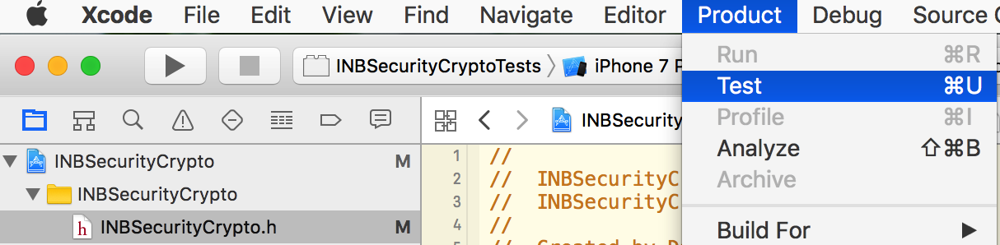

# INBSecurityCrypto

## Cryptography contents

* You can build a dynamic framework via the `INBSecurityCrypto` target.

* You can test the codes via the `INBSecurityCryptoTests` target.

### Using

For iOS 8 and later, you can use dynamic framework. (The deployment target `greater than or equal to 8.0.0`.)

For iOS 6 and later, you can add the source codes to project. (The deployment target `less than 8.0.0`.)

If an error occurs：`Include of non-modular header inside framework module ***`

Yous can set `Allow Non-modular Includes In Framework Modules` to `YES` (In `TARGETS -> Build Settings -> Language - Modules`)

You may should add `-ObjC` to `TARGETS -> Build Settings -> Linking -> Other Linker Flags`.

### Supported Encryption Algorithms

#### Public-key Encryption Algorithm

* RSA（Only support PKCS1 Padding mode. Only support the use of secure hash algorithms when sign data with private key.）

#### Block Symmetric Encryption Algorithms

Only support PKCS7 Padding、No Padding modes.

Only support ECB、CBC modes.

* AES（AES-128、AES-192、AES-256）
* DES
* TripleDES（3DES）
* CAST
* RC2
* Blowfish

### Supported Hash Algorithms

#### Message Digest

* MD 2
* MD 4
* MD 5

#### Secure Hash Algorithms

* SHA1
* SHA224
* SHA256
* SHA384
* SHA512

### Supported HMACs(Hash-based Message Authentication Code)

* Hmac MD5
* Hmac SHA1
* Hmac SHA224
* Hmac SHA256
* Hmac SHA384
* Hmac SHA512

### Supported Encoding Algorithms

* Base64
* Hex

